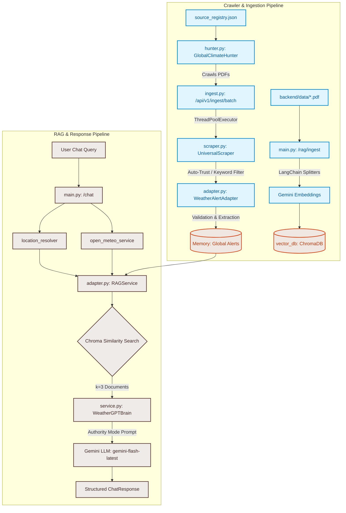

# 🌦️ WeatherGPT: RAG & Scraper Walkthrough

WeatherGPT is a Retrieval-Augmented Generation (RAG) assistant designed for the Ministry of Earth Sciences (MoES). It combines live weather reports, active alerts, and scraped disaster safety manuals to provide trustworthy disaster-safety answers, complete with agency citations.

---

## 🗺️ System Architecture

The following diagram illustrates how the scraping pipeline and RAG query process operate and interact:



---

## 📁 File Structure & Mapping

Here are the key modules and their file locations in the repository:

*   **Ingestion & Scraper Service**:
    *   [`source_registry.json`](file:///c:/Users/Tahmeed%20Alam/.gemini/antigravity-ide/scratch/WeatherGPT/backend/data/source_registry.json): Registry of trusted links/feeds (National IMD, RMCs, Disaster Management, Marine, Agromet).
    *   [`hunter.py`](file:///c:/Users/Tahmeed%20Alam/.gemini/antigravity-ide/scratch/WeatherGPT/backend/services/ingestion/hunter.py): Crawls and scans links in the registry to identify and fetch PDF bulletins, then issues batch ingestion calls.
    *   [`scraper.py`](file:///c:/Users/Tahmeed%20Alam/.gemini/antigravity-ide/scratch/WeatherGPT/backend/services/ingestion/scraper.py): Universal document text extractor supporting Web URLs, HTML, PDF, Word (DOCX), Excel (XLSX), JSON, and Plain Text.
    *   [`adapter.py`](file:///c:/Users/Tahmeed%20Alam/.gemini/antigravity-ide/scratch/WeatherGPT/backend/services/ingestion/adapter.py): Transforms and maps scraped raw text to a structured `WeatherAlert` schema, handling location detection and severity parsing.
    *   [`ingest.py`](file:///c:/Users/Tahmeed%20Alam/.gemini/antigravity-ide/scratch/WeatherGPT/backend/services/api/v1/ingest.py): FastAPI batch router that handles concurrent multi-source document ingestion.
*   **RAG Core**:
    *   [`embeddings.py`](file:///c:/Users/Tahmeed%20Alam/.gemini/antigravity-ide/scratch/WeatherGPT/backend/services/rag/embeddings.py): Handles GoogleGenerativeAIEmbeddings setup.
    *   [`vector_store.py`](file:///c:/Users/Tahmeed%20Alam/.gemini/antigravity-ide/scratch/WeatherGPT/backend/services/rag/vector_store.py): Directs database storage loader and PDF file batch parsing.
    *   [`retriever.py`](file:///c:/Users/Tahmeed%20Alam/.gemini/antigravity-ide/scratch/WeatherGPT/backend/services/rag/retriever.py): Executes ChromaDB similarity querying.
    *   [`service.py`](file:///c:/Users/Tahmeed%20Alam/.gemini/antigravity-ide/scratch/WeatherGPT/backend/services/rag/service.py): High-level coordinator coordinating vectors retrieval, prompting, and Gemini model generation.
    *   [`adapter.py`](file:///c:/Users/Tahmeed%20Alam/.gemini/antigravity-ide/scratch/WeatherGPT/backend/services/rag/adapter.py): Wraps the coordinator to provide a stable schema integration with the API endpoints.
*   **API & Core**:
    *   [`main.py`](file:///c:/Users/Tahmeed%20Alam/.gemini/antigravity-ide/scratch/WeatherGPT/backend/main.py): FastAPI app entry point exposing endpoints, managing state, and mounting the static frontend.
    *   [`schemas.py`](file:///c:/Users/Tahmeed%20Alam/.gemini/antigravity-ide/scratch/WeatherGPT/backend/schemas.py): Pydantic specifications for shared data exchange (Weather, Locations, Alerts, RAG documents, ChatRequest, and ChatResponse).

---

## 🕷️ The Scraper Pipeline (`ingestion`)

### 1. Link Hunting (`hunter.py`)
The pipeline begins at [`hunter.py`](file:///c:/Users/Tahmeed%20Alam/.gemini/antigravity-ide/scratch/WeatherGPT/backend/services/ingestion/hunter.py).
*   **Source Discovery:** Reads [`source_registry.json`](file:///c:/Users/Tahmeed%20Alam/.gemini/antigravity-ide/scratch/WeatherGPT/backend/data/source_registry.json) to retrieve targeted URLs.
*   **PDF Crawling:** Requests each page, parses anchors (`<a>`) using BeautifulSoup, identifies URL endings in `.pdf`, and normalizes them into fully-qualified links.
*   **Handover:** Posts the batch of discovered PDFs to the backend ingestion endpoint `http://127.0.0.1:8000/api/v1/ingest/batch` to keep the engine synchronized.

### 2. Multi-Format Extraction (`scraper.py`)
The scraper class [`UniversalScraper`](file:///c:/Users/Tahmeed%20Alam/.gemini/antigravity-ide/scratch/WeatherGPT/backend/services/ingestion/scraper.py) handles extraction from multiple file types:
*   **Web URLs / HTML:** Uses `requests` with a browser User-Agent header, then strips script tags, headers, footers, styles, and SVG markup using `BeautifulSoup` (with regex backfalls if `bs4` is missing).
*   **PDF Documents:** Reads document pages and extracts layout text using PyMuPDF (`fitz`).
*   **Word Documents (`.docx`):** Parses document paragraphs and extracts tables, formatting cells with standard piping (`|`).
*   **Excel Spreadsheets (`.xlsx`, `.xls`):** Iterates over all sheets using `pandas` and `openpyxl`, dropping empty rows/columns, and serializing contents to string tables.
*   **JSON:** Recursively flattens nested dictionaries and lists into a structured key-value text format.
*   **Text/CSV/Log:** Reads file content directly using standard UTF-8 decoding (ignoring parsing errors gracefully).

### 3. Relevance Filtering (`scraper.py`)
To prevent irrelevant files from flooding the database, extracted text is analyzed against a keyword lexicon:
*   **Lexicon Scope:** Includes over 50 keywords divided into Meteorologic Forecasting, Indian hazards (e.g., cloudburst, storm surge, cold wave), Agromet terms (GKMS, crop, kharif), Coastal parameters, and Indian regional names (mausam, chakravat, toofan).
*   **Auto-Trust Rule:** Skip keywords checks and auto-trust documents hailing from official domains: `imd.gov.in`, `ndma.gov.in`, or `incois.gov.in`.

### 4. Alert Adaptation & Normalization (`adapter.py`)
After a source passes relevance filtering, the [`WeatherAlertAdapter`](file:///c:/Users/Tahmeed%20Alam/.gemini/antigravity-ide/scratch/WeatherGPT/backend/services/ingestion/adapter.py) refines the text:
*   **Location Extraction:** Compiles a regex combining a comprehensive roster of Indian States, UTs, and major cities/districts (sorted descending by string length to match long names like "Jammu and Kashmir" before "Jammu"). Matches are title-cased.
*   **Severity Mapping:**
    *   **Extreme:** If keywords like *red alert, extremely severe, catastrophic, cloudburst, landslide disaster* are matched.
    *   **High:** If keywords like *warning, orange alert, heavy rainfall, cyclone, flood alert* are matched.
    *   **Moderate:** Default mapping.
*   **Title/Description Tuning:** Extracts first line (under 120 chars) as title (falling back to filename). Cleaned text is prefixed with its mapped location context, e.g. `[Location: Kolkata] ...`.

### 5. High-Throughput Batch Ingestion (`ingest.py`)
Exposes `/api/v1/ingest/batch` running extraction tasks concurrently across a `ThreadPoolExecutor` (configurable `max_workers` up to 50). It outputs execution statistics (succeeded, failed counts) and appends valid alerts thread-safely via lock to the live system memory.

---

## 🧠 The RAG Pipeline (`rag`)

### 1. Vector Database Ingestion
*   Triggered manually via `/rag/ingest` or automatically.
*   Uses `PyPDFLoader` to read documents from `backend/data/`.
*   Uses LangChain's `RecursiveCharacterTextSplitter` with:
    *   `chunk_size`: 1000 characters
    *   `chunk_overlap`: 150 characters
*   Embeds chunks using Google GenAI embeddings (`models/gemini-embedding-001`).
*   Stores and indexes them inside a local Chroma database directory at `backend/vector_db/`.

### 2. Guardrails & Routing (`brain.py`)
To filter out off-topic queries, the brain applies verification rules:
*   **Domain Matching:** Checks if a location is resolved, or if the user query contains a key weather keyword (e.g., rain, cyclone, temperature, umbrella, travel, NDMA, etc.).
*   **Fallback:** If the query is off-topic, it returns a standard greeting: *"I am WeatherGPT and can help with weather and disaster-safety questions."* bypasses Chroma/Gemini to conserve LLM tokens.

### 3. Context Construction & Semantic Search
*   Retrieves the top `k=3` relevant chunks using `similarity_search_with_relevance_scores` from ChromaDB.
*   Retrieves active live alerts corresponding to the target location.
*   Packages the metadata, page numbers, and snippet sources (e.g., `bulletin.pdf (Page 2)`).
*   Constructs a highly detailed prompt instructing the model to act in **MoES Authority Mode**.

### 4. Authority Mode & LLM Generation
The prompt enforces the following guidelines to `gemini-1.5-flash`:
1.  **Strict Ranking:** Start with red alerts/special bulletins, follow with regional RMC or hydrology updates, and then agromet/marine advisories.
2.  **Agency Citations:** Explicitly mention where the source was fetched from (e.g., *"According to RMC Kolkata..."*, *"Based on INCOIS marine data..."*).
3.  **Balanced Safety Warnings:** If a user asks "Is it safe to go out?", even if there's no active red alert, cross-reference high humidity or thunderstorms in the context to offer warning guidelines.
4.  **No Hallucinations:** Differentiate live weather numbers from static guidance text and restrict inventiveness.

---

## 🚀 API Endpoints

### 1. Check System Health
```bash
GET http://127.0.0.1:8000/health
```

### 2. Ingest Bulletins (Vector DB)
Manually process local PDF files inside `backend/data/` and store them in the Chroma vector store.
```bash
POST http://127.0.0.1:8000/rag/ingest
```

### 3. Concurrent Batch Ingest (Scraper)
Scrape and process a batch of URLs/files in parallel.
```bash
POST http://127.0.0.1:8000/api/v1/ingest/batch
Content-Type: application/json

{
  "sources": [
    "https://mausam.imd.gov.in/kolkata/",
    "backend/data/national_bulletin.pdf"
  ],
  "max_workers": 10
}
```

### 4. RAG Chat
Sends queries to WeatherGPT. Returns weather data, live alerts, generated reply, and source citations.
```bash
POST http://127.0.0.1:8000/chat
Content-Type: application/json

{
  "query": "Is it safe to go outside in Mumbai, and are there any heavy rain warnings?",
  "location": {
    "city": "Mumbai"
  },
  "language": "en"
}
```

---

## 💻 Local Setup & Execution

1.  **Configure Environment:**
    Create a `backend/.env` file with your Google Gemini credentials:
    ```env
    GEMINI_API_KEY=your_gemini_api_key_here
    ```

2.  **Install Dependencies:**
    ```bash
    python -m venv .venv
    source .venv/bin/activate        # On Windows: .venv\Scripts\activate
    pip install -r backend/requirements.txt
    ```

3.  **Run the Dev Server** (must be running before the next steps):
    ```bash
    uvicorn backend.main:app --reload
    ```
    *   Backend API docs: `http://127.0.0.1:8000/docs`
    *   Interactive UI: `http://127.0.0.1:8000/`

4.  **Ingest Local PDF Bulletins into the RAG Vector DB** (run once, or after adding new PDFs to `backend/data/`):
    ```bash
    curl -X POST http://127.0.0.1:8000/rag/ingest
    ```
    > This reads all `.pdf` files from `backend/data/`, chunks them, embeds them via Gemini, and stores them in `backend/vector_db/`.

5.  **Run the Link Hunter** (optional — populates live alerts in memory from govt sources):
    > ⚠️ The server from Step 3 **must be running** before you execute this.
    ```bash
    .venv/bin/python -m backend.services.ingestion.hunter
    ```
    This scans all URLs in `backend/data/source_registry.json`, discovers PDF links on IMD/NDMA/INCOIS pages, and POSTs them to `/api/v1/ingest/batch` to populate the in-memory alerts list.
    > Note: Alerts are held **in memory only** and will be cleared on server restart.
