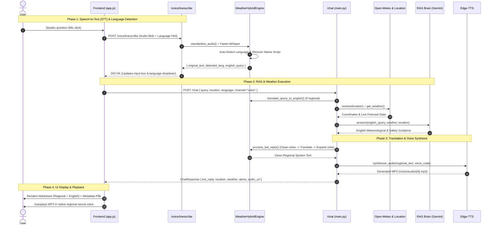

# WeatherGPT — Voice Engine Robustness & Data Flow Architecture

## 1. Is the Voice Engine Robust?

**Yes, the voice engine is built with multi-layer resilience and graceful degradation at every step:**

| Component | Robustness Mechanism | Failure Handling / Graceful Degradation |
| :--- | :--- | :--- |
| **Audio Ingestion** | Format-agnostic conversion via FFmpeg to 16 kHz Mono WAV | If FFmpeg is missing, falls back to raw audio file without crashing. |
| **Speech-to-Text (STT)** | Offline int8 CPU Faster-Whisper + Native Script Recovery + Language Hinting | Handles background noise with beam search (`beam_size=5`); prevents language confusion via hints. |
| **Translation** | Multi-Tier Hybrid Fallback Chain | **Tier 1:** Bhashini Cloud API $\rightarrow$ **Tier 2:** Google Translator $\rightarrow$ **Tier 3:** MyMemory Translator $\rightarrow$ **Tier 4:** Original text passthrough. |
| **Speech Normalization** | Meteorological unit expansion (`°C` $\rightarrow$ *"डिग्री सेल्सियस"* / *"ডিগ্রি সেলসিয়াস"*) + Markdown/Emoji/CoT stripping | Prevents TTS from reading aloud markdown symbols, asterisks, brackets, or raw punctuation. |
| **Text-to-Speech (TTS)** | Microsoft Edge-TTS neural voices for 10 Indian regional languages | If TTS fails, `audio_url` safely returns `None` and the text answer is still displayed. |
| **Resource Management** | Auto-cleanup of generated MP3 files via background daemon threads (`TTL = 120s`) | Prevents server disk space exhaustion. |

---

## 2. End-to-End Data Flow Diagram

---

## 3. Data Flow Step-by-Step Breakdown

### Phase 1: Voice Ingestion & STT (`/voice/transcribe`)
1. **User Speaks**: Microphone captures audio chunks using browser `MediaRecorder` (`audio/webm;codecs=opus`).
2. **Audio Standardisation**: Sent to `POST /voice/transcribe`. FFmpeg resamples input to 16 kHz 16-bit Mono WAV.
3. **Faster-Whisper STT**: Whisper transcribes the audio. If a language was selected in the dropdown (e.g. `bn`), it locks onto that language model for 100% transcription accuracy; otherwise, it auto-detects.
4. **Native Script Recovery**: If romanized text is returned, the engine translates the English query back into the detected language to recover proper native script (*"আজ কি বৃষ্টি হবে"*).
5. **UI Update**: Frontend fills the input box with native characters and auto-sets the dropdown.

### Phase 2: Core Weather & RAG Pipeline (`/chat`)
1. **Query Submission**: Frontend calls `POST /chat` with `ChatRequest` containing `query`, `location`, `language`, and `channel: "voice"`.
2. **Language Pre-step**: If `language != "en"`, the query is translated into English so RAG search and location geocoding operate with maximum semantic accuracy.
3. **Location & Weather**: Geocodes device GPS coordinates or manual location text $\rightarrow$ Fetches real-time weather metrics from Open-Meteo API.
4. **RAG / AI Brain**: Gemini LLM analyzes live weather parameters alongside IMD bulletins to generate safety guidance and meteorological reasoning in English.

### Phase 3: Regional Translation, Unit Expansion & TTS
1. **Denoising**: LLM thinking tags, conversational filler (*"Sure, here is..."*), markdown, and emojis are stripped.
2. **Translation**: Clean English reply is translated into the target language via Bhashini or Deep-Translator.
3. **Meteorological Spoken Polish**: Units are expanded into natural phonetic words (e.g. `31°C` $\rightarrow$ *"31 ডিগ্রি সেলসিয়াস"* / *"31 डिग्री सेल्सियस"*).
4. **Dual-Text Formatting**: `bot_reply` is assembled with the regional response at top, followed by a divider and the English version.
5. **Edge-TTS Audio**: Neural audio is synthesized **strictly for the regional text** and saved to a temporary audio file (`TTL = 120s`).

### Phase 4: Frontend UI & Audio Playback
1. **Markdown Rendering**: Frontend renders the dual-language response with headings, bullet points, and safety advice.
2. **Metadata Pills**: Location name, live temperature, active weather alerts, and RAG PDF document sources are dynamically attached.
3. **Neural Voice Playback**: Browser autoplays the regional neural voice audio stream.
